# 《实验三：聚合操作练习》

**学院：省级示范性软件学院**

**题目：****《实验三：聚合操作练习》**

姓名：罗云平

学号：2202

班级：软工2202

日期：2024-10-14

实验环境：Elasticsearch8.12.2 Kibana8.12.2

## 一、**实验目的**

- 掌握聚合操作与数据分析


## 二、**实验内容**

### **1.**建立索引

```json
PUT /ecommerce
{
  "mappings": {
    "properties": {
      "order_id": { "type": "keyword" },
      "order_date": { "type": "date" },
      "customer_id": { "type": "keyword" },
      "customer_name": { "type": "keyword" },
      "customer_gender": { "type": "keyword" },
      "customer_age": { "type": "integer" },
      "customer_city": { "type": "keyword" },
      "product_id": { "type": "keyword" },
      "product_name": { "type": "keyword" },
      "product_category": { "type": "keyword" },
      "quantity": { "type": "integer" },
      "price": { "type": "float" },
      "total_amount": { "type": "float" },
      "payment_method": { "type": "keyword" },
      "is_returned": { "type": "boolean" }
    }
  }
}
```

### **2.**批量导入数据

```
POST /ecommerce/_bulk
```

[ecommerce_data]([ecommerce_data.json · 语雀 (yuque.com)](https://www.yuque.com/raw?filekey=yuque%2F0%2F2024%2Fjson%2F550753%2F1728523648216-b1bcce8e-9059-4fda-ba2c-f00ea59623d3.json&from=https%3A%2F%2Fwww.yuque.com%2Fu369937%2Fwskurb%2Fnizzczly3ahu08t9))

### 3.**题目**

1. 统计每个产品类别的总销售额。

   ```json
   POST /ecommerce/_search
   {
     "size": 0, 
     "aggs":{
     "categories":{
       "terms":{
         "field":"product_category"
       },
       "aggs":{
         "total_sales":{
           "sum":{
             "field":"total_amount"
           }
         }
       }
     }
    }
   }
   ```

   

2. 计算每个城市的平均订单金额。

   ```json
   POST /ecommerce/_search
   {
     "size": 0, 
     "aggs":{
       "cities":{
         "terms":{
           "field":"customer_city"
         },
         "aggs":{
           "avg_order_amount":{
             "avg":{
               "field":"total_amount"
             }
           }
         }
       }
     }
   }
   ```

   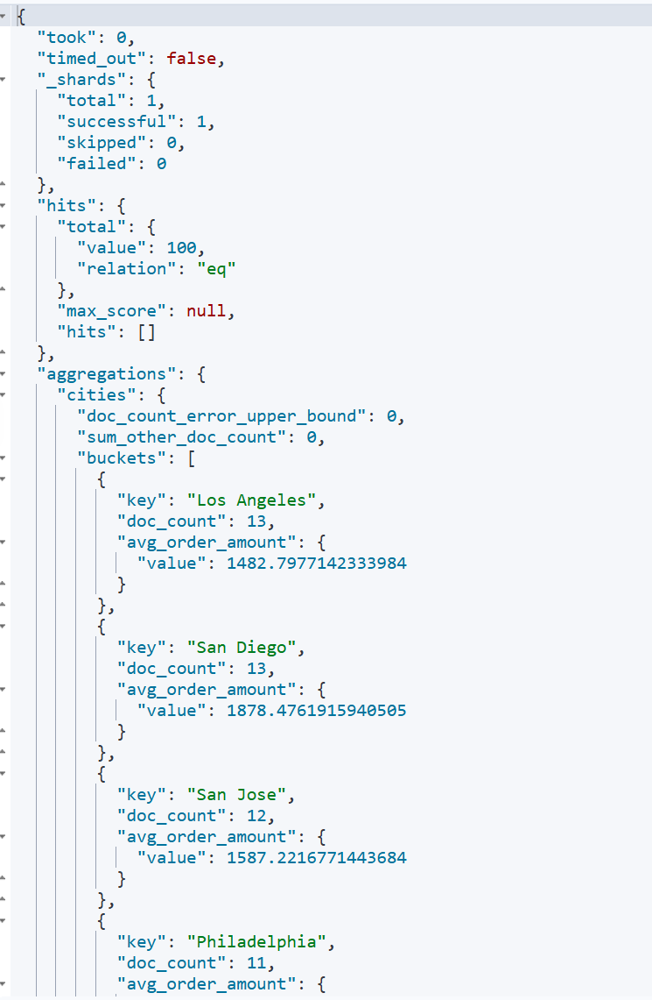

3. 找出销量最高的前5个产品

   ```json
   POST /ecommerce/_search
   {
     "size": 0, 
     "aggs": {
       "top5_product": {
         "terms": {
           "field": "product_id",
           "size": 5,
           "order": {
             "total_sales": "desc"
           }
         },
         "aggs": {
           "total_sales": {
             "sum": {
               "field": "quantity"
             }
           }
         }
       }
     }
   }
   ```

   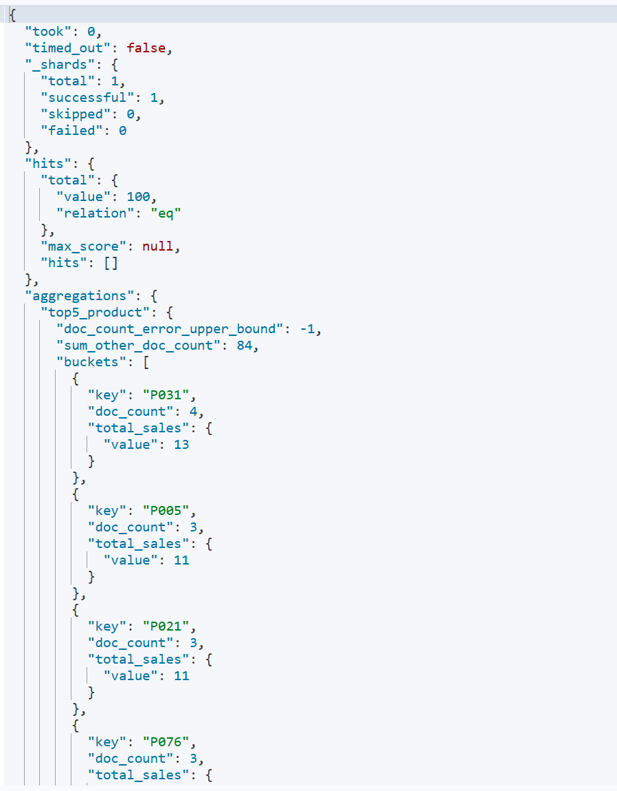

4. 计算男性和女性客户的平均年龄。

   ```json
   POST /ecommerce/_search
   {
     "size": 0,
     "aggs": {
       "genders": {
         "terms": {
           "field": "customer_gender"
         },
         "aggs": {
           "avg_ages": {
             "avg": {
               "field": "customer_age"
             }
           }
         }
       }
     }
   }
   ```

   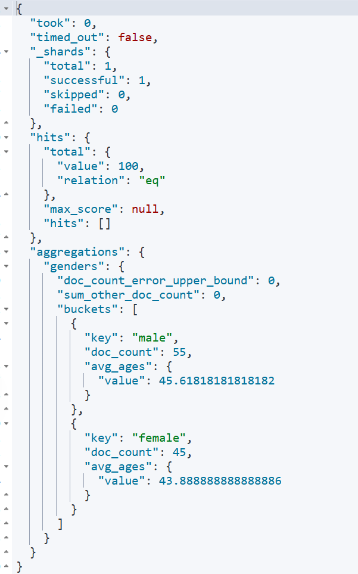

5. 统计每种支付方式的使用次数和总金额。

   ```json
   POST /ecommerce/_search
   {
     "size": 0,
     "aggs": {
       "payments": {
         "terms": {
           "field": "payment_method"
         },
         "aggs": {
           "usage_count": {
             "value_count": {
               "field": "payment_method"
             }
           },
           "total_amount":{
             "sum": {
               "field": "total_amount"
             }
           }
         }
       }
     }
   }
   ```

   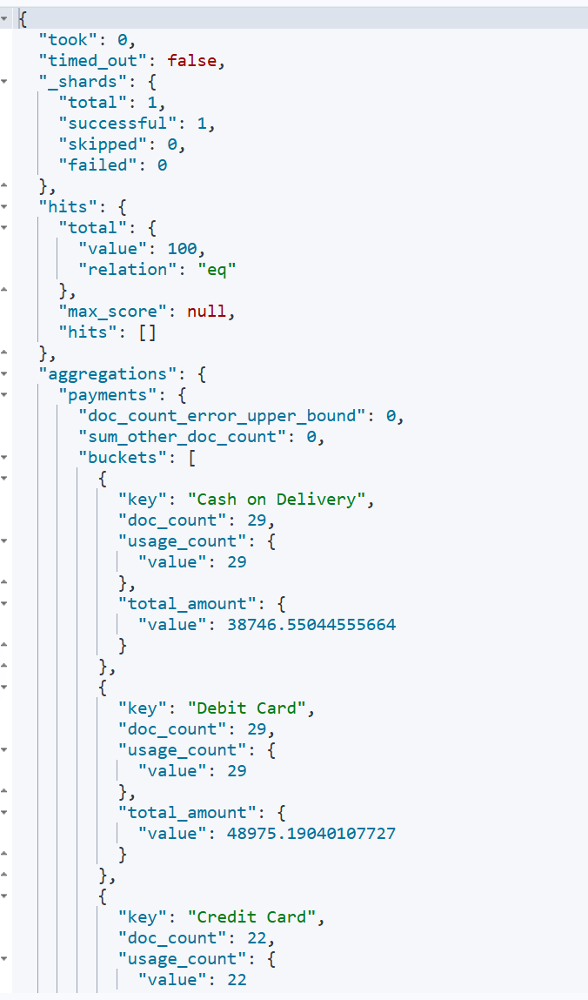

6. 计算每月的总销售额。

   ```json
   POST /ecommerce/_search
   {
     "size": 0, 
     "aggs": {
       "sale_by_month": {
         "date_histogram": {
           "field": "order_date",
           "calendar_interval": "month",
           "format": "yyyy-MM"
         },
         "aggs": {
           "sale_acount": {
             "sum": {
               "field": "total_amount"
             }
           }
         }
       }
     }
   }
   ```

   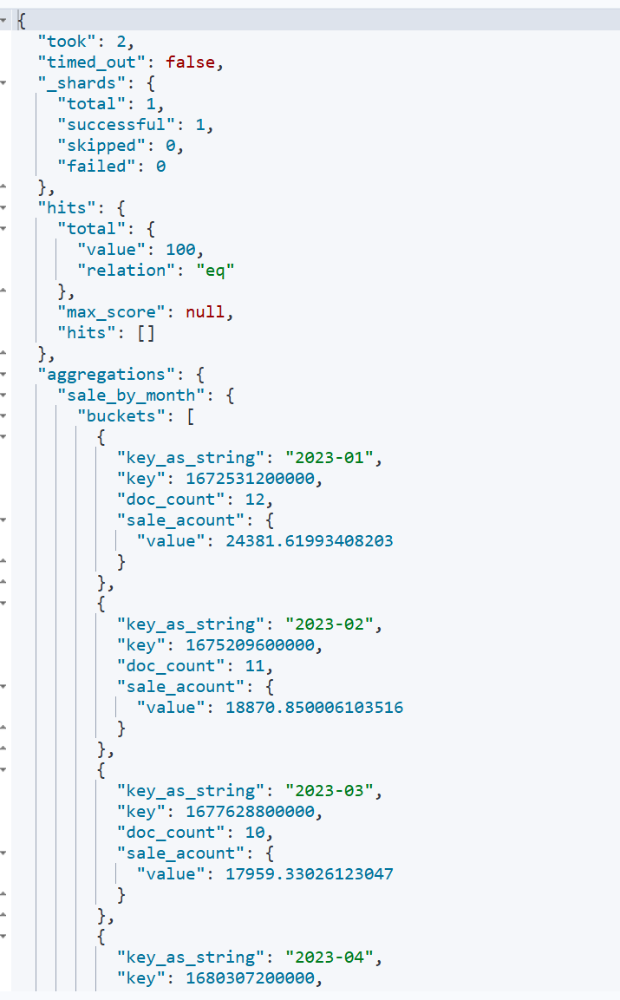

7. 找出平均订单金额最高的前3个客户。

   ```json
   POST /ecommerce/_search
   {
     "size": 0, 
     "aggs": {
       "top3_customer": {
         "terms": {
           "field": "customer_id",
           "order": {
             "avg_sales": "desc"
           }
         },
         "aggs": {
           "avg_sales": {
             "avg": {
               "field": "total_amount"
             }
           }
         }
       }
     }
   }
   ```

   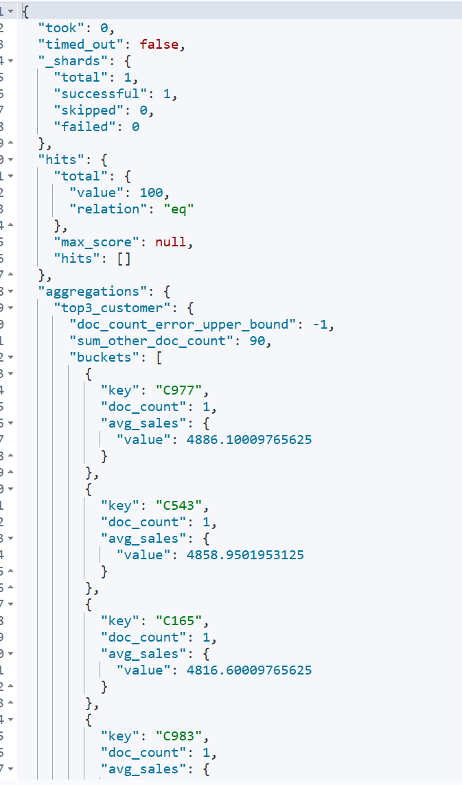

8. 计算每个年龄段（18-30，31-50，51+）的客户数量。

   ```json
   POST /ecommerce/_search
   {
     "size": 0, 
     "aggs": {
       "age_ranges": {
         "range": {
           "field": "customer_age",
           "ranges": [
               {"from": 18,"to":30}, 
               {"from": 31,"to":50},
               {"from": 51}
           ]
         },
         "aggs": {
           "customer_acount": {
             "cardinality": {
               "field": "cutomer_id"
             }
           }
         }
       }
     }
   }
   ```

   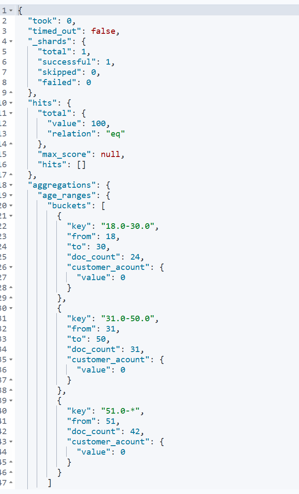

9. 计算每个产品类别的平均单价。

   ```json
   POST /ecommerce/_search
   {
     "size": 0, 
     "aggs": {
       "categories": {
         "terms": {
           "field": "product_category"
         },
         "aggs": {
           "avg_price": {
             "avg": {
               "field": "price"
             }
           }
         }
       }
     }  
   }
   ```

   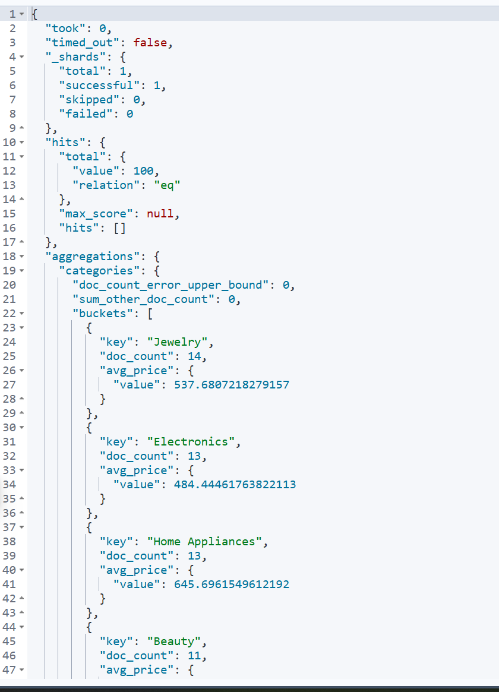

10. 找出订单数量最多的前5个城市。

    ```json
    POST /ecommerce/_search
    {
      "size": 0,
      "aggs": {
        "top5_city": {
          "terms": {
            "field": "customer_city",
            "order": {
              "order_acount": "desc"
            }
          },
          "aggs": {
            "order_acount": {
              "cardinality": {
                "field": "order_id"
              }
            }
          }
        }
      }
    }
    ```

    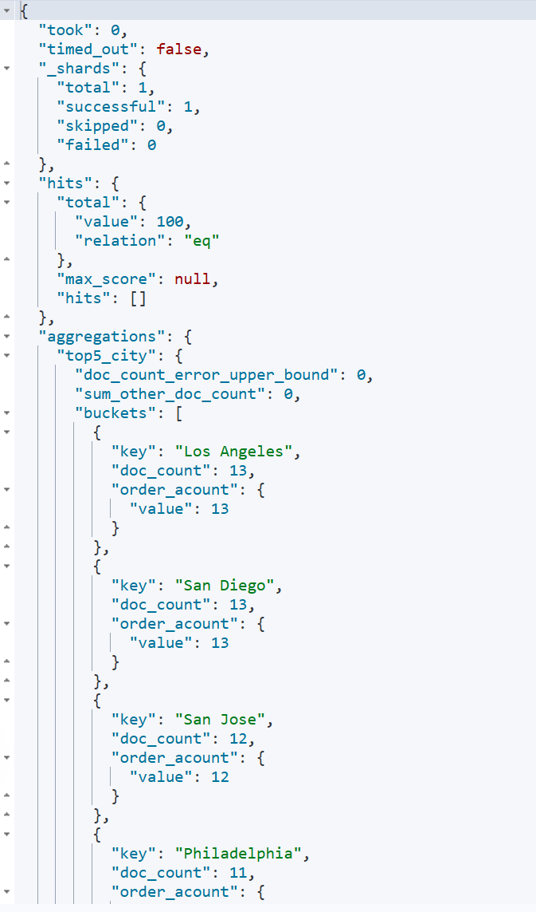

11. 计算每个季度的平均订单金额。

    ```json
    POST /ecommerce/_search
    {
      "size": 0,
      "aggs": {
        "quarters": {
          "date_histogram": {
            "field": "order_date",
            "calendar_interval": "quarter",
            "format": "yyyy-MM-dd"
          },
          "aggs": {
            "avg_order_amount": {
              "avg": {
                "field": "total_amount"
              }
            }
          }
        }
      }
    }
    ```

    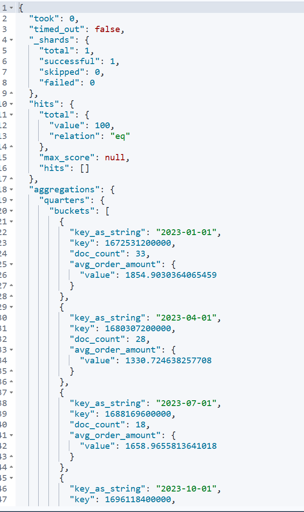

12. 统计每个产品类别中的商品数量。

    ```json
    POST /ecommerce/_search
    {
      "size": 0,
      "aggs": {
        "categories": {
          "terms": {
            "field": "product_category"
          },
          "aggs": {
            "product_amount": {
              "sum": {
                "field": "quantity"
              }
            }
          }
        }
      }
    }
    ```

    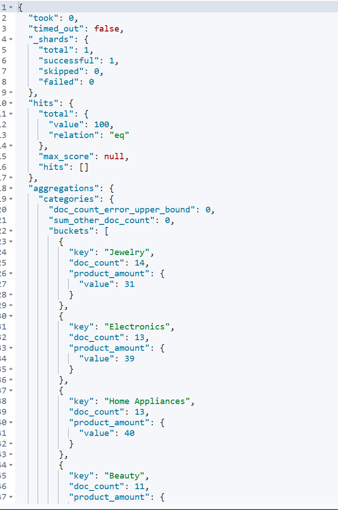

13. 计算男性和女性客户的平均订单金额。

    ```json
    POST /ecommerce/_search
    {
      "size": 0,
      "aggs": {
        "gender_terms": {
          "terms": {
            "field": "customer_gender"
          },
          "aggs": {
            "avg_order_amount": {
              "avg": {
                "field": "total_amount"
              }
            }
          }
        }
      }
    }
    ```

    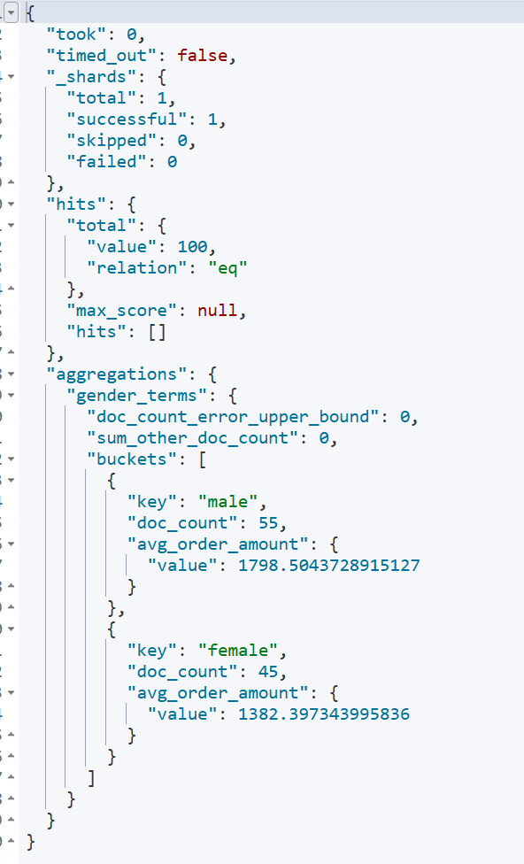

14. 找出总销售额最高的前10个日期。

    ```json
    POST /ecommerce/_search
    {
      "size": 0,
      "aggs": {
        "sales_per_date": {
          "date_histogram": {
            "field": "order_date",
            "calendar_interval": "day",
            "format": "yyyy-MM-dd"
          },
          "aggs": {
            "total_sales": {
              "sum": {
                "field": "total_amount"
              }
            },
            "top_dates":{
              "bucket_sort": {
                "sort": [
                  {
                    "total_sales":{
                      "order":"desc"
                    }
                  }
                  ],
                  "size": 10
              }
            }
          }
        }
      }
    }
    ```

    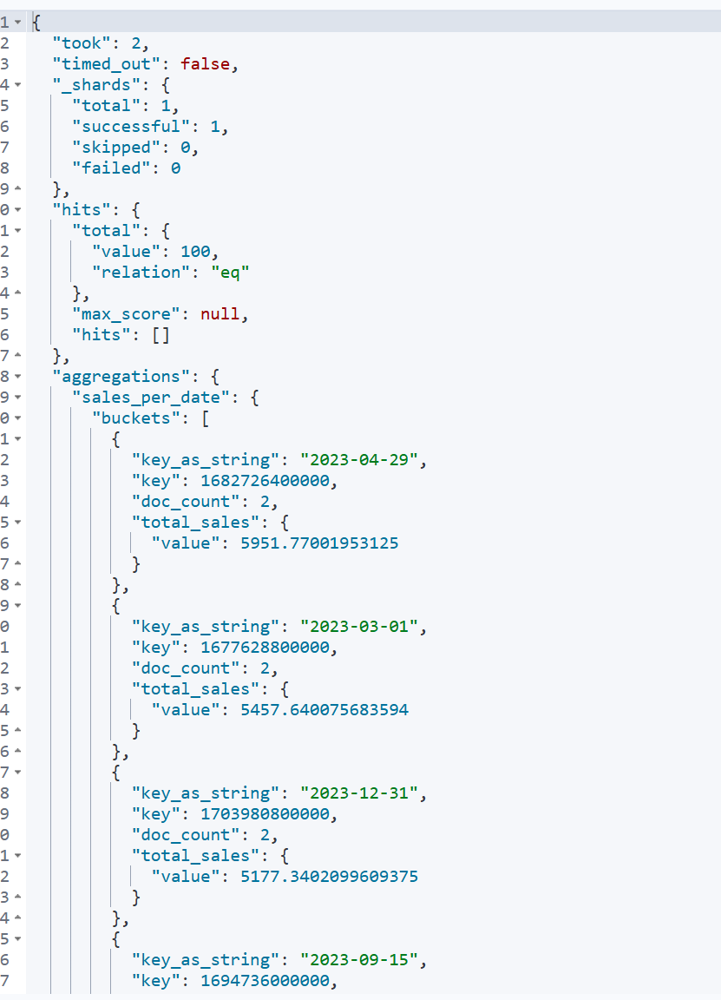

15. 计算每个季度销售额最高的产品类别。

    ```json
    POST /ecommerce/_search
    {
      "size": 0,
      "aggs": {
        "quaters": {
          "date_histogram": {
            "field": "order_date",
            "calendar_interval": "quarter"
          },
          "aggs": {
            "categories": {
              "terms": {
                "field": "product_category.keyword",
                "size": 1,
                "order": {
                  "sales_amount": "desc"
                }
              },
              "aggs": {
                "sales_amount": {
                  "sum": {
                    "field": "total_amount"
                  }
                }
              }
            }
          }
        }
      }
    }
    ```

    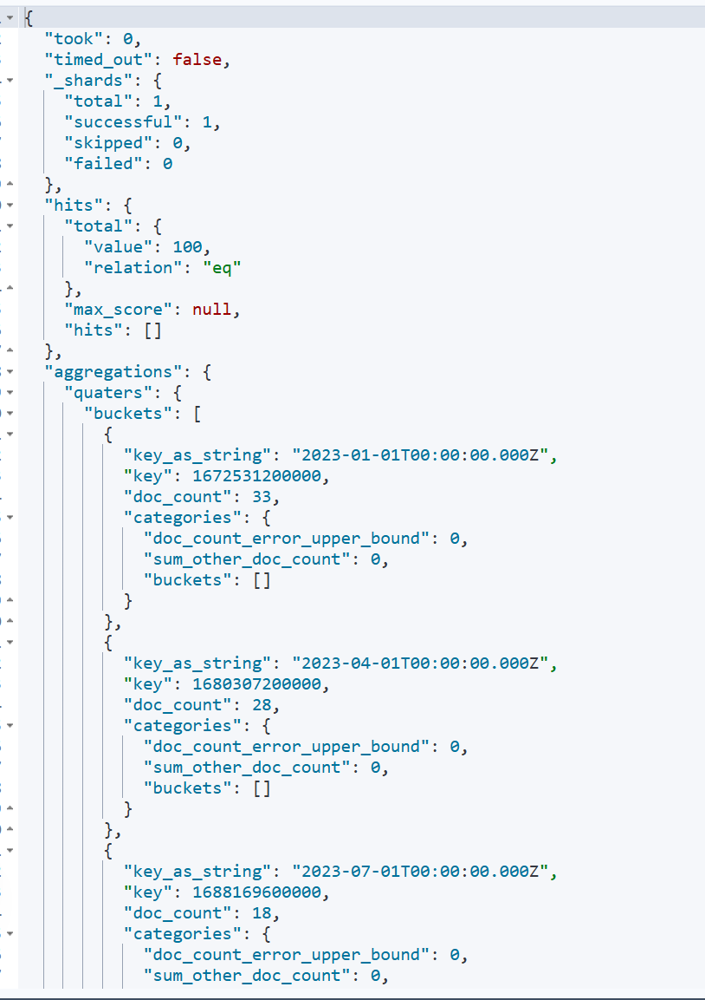

16. 计算每天的订单数量，并显示7天移动平均值。

    ```json
    POST /ecommerce/_search
    {
      "size": 0,
      "aggs": {
        "daily_order_count": {
          "date_histogram": {
            "field": "order_date",
            "calendar_interval": "day",
            "format": "yyyy-MM-dd"
          },
          "aggs": {
            "order_count": {
              "value_count": {
                "field": "order_id"
              }
            },
            "moving_avg":{
              "moving_fn": {
                "buckets_path": {
                  "count":"order_count"
                },
                "script": "params.count.stream().mapToDouble(x -> x).",
                "window": 7
              }
            }
          }
        }
      }
    }
    ```

    

17. 比较本月销售额与上月销售额的差异。

    ```json
    POST /ecommerce/_search
    {
      "size": 0,
      "aggs": {
        "month_sales": {
          "date_histogram": {
            "field": "order_date",
            "calendar_interval": "month",
            "format": "yyyy-MM",
            "order": {
              "key": "asc"
            }
          },
          "aggs": {
            "total_sales": {
              "sum": {
                "field": "total_amount"
              }
            }
          }
        },
        "current_month":{
          "bucket_selector": {
            "buckets_path": {
              "current_month_sales":"month_sales[0].total_sales"
            },
            "script": "params.current_month_sales != null ? params.current_month_sales : 0"
          }
        },
        "last_month": {
          "bucket_selector": {
            "buckets_path": {
              "last_month_sales": "monthly_sales[1].total_sales"  // 上月的销售额
            },
            "script": "params.last_month_sales != null ? params.last_month_sales : 0"
          }
        },
        "sales_difference": {
          "bucket_script": {
            "buckets_path": {
              "current_month": "current_month",
              "last_month": "last_month"
            },
            "script": "params.current_month - params.last_month"  // 计算两个月份的差异
          }
        }
      }
    }
    ```

    

18. 计算每周的总销售额，并找出销售额增长最快的一周。

    ```json
    GET /ecommerce/_search
    {
      "size": 0,
      "aggs": {
        "weekly_sales": {
          "date_histogram": {
            "field": "order_date",
            "calendar_interval": "week",
            "format": "yyyy-ww",
            "order": {
              "key": "asc"
            }
          },
          "aggs": {
            "total_sales": {
              "sum": {
                "field": "total_amount"
              }
            },
            "sales_growth": {
              "serial_diff": {
                "buckets_path": {
                  "current": "total_sales"
                },
                "lag": 1
              }
            }
          }
        },
        "max_growth": {
          "max_bucket": {
            "buckets_path": "weekly_sales>sales_growth"
          }
        }
      }
    }
    ```

    

