# 《**实验四 Logstash操作**》

**学院：省级示范性软件学院**

**题目：****《实验四：Logstash操作》**

姓名：罗云平

学号：2202

班级：软工2202

日期：2024-10-26

实验环境：Elasticsearch8.12.2 Kibana8.12.2

## 一、**实验目的**

- 掌握Logstash操作并进行数据转换和传输

## 二、**实验要求**

**2.1：**

- 将tomcat的logs中的localhost_access_log访问日志导入到本地的elasticsearch中。

- 数据导入到一个名为tomcat_logs的索引。

- 在elasticsearch中做5个日志相关的分析，题目自拟。（提示：可以参考第04章聚合操作日志实战内容）

**2.2：**

- 将本地的mysql数据库中的一张表导入到本地的elasticsearch中。
- 数据库表更新后，数据能够自动同步到elasticsearch中

## 三、实验内容

#### **3.1 tomcat日志处理**

- 3.1.1 编辑tomcat_access_logs.conf配置文件

  ```
  input {
    file {
      path => "D:/Tools/HighDatabase/tomcat_logs/localhost_access_log.*"  # 使用通配符匹配所有相关日志文件
      start_position => "beginning"
      sincedb_path => "NUL"
    }
  }
  
  filter {
    grok {
      match => { "message" => "%{IP:client_ip} - - \[%{HTTPDATE:timestamp}\] \"%{WORD:method} %{URIPATHPARAM:request} HTTP/%{NUMBER:http_version}\" %{NUMBER:response_code} %{NUMBER:bytes}" }
    }
  
    # 确保响应时间字段解析出来
    mutate {
      rename => { "bytes" => "response_time" }
      convert => { "response_time" => "integer" }
    }
    
    # 日期解析
    date {
      match => [ "timestamp", "dd/MMM/yyyy:HH:mm:ss Z" ]
      target => "@timestamp"
    }
  }
  
  output {
    stdout { codec => rubydebug }
    elasticsearch {
      hosts => ["http://localhost:9200"]
      index => "tomcat_logs"  
    }
  }
  ```

- 3.1.2 启动logstash

  在`D:\Tools\HighDatabase\logstash-8.12.2`目录下

  ```
  bin\logstash.bat -f D:\Tools\HighDatabase\logstash-8.12.2\config\tomcat_access_logs.conf"
  ```

- 3.1.3 在ES中查看tomcat_logs索引是否建立成功&数据是否上传成功

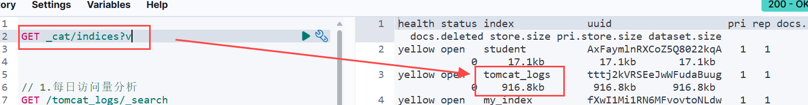

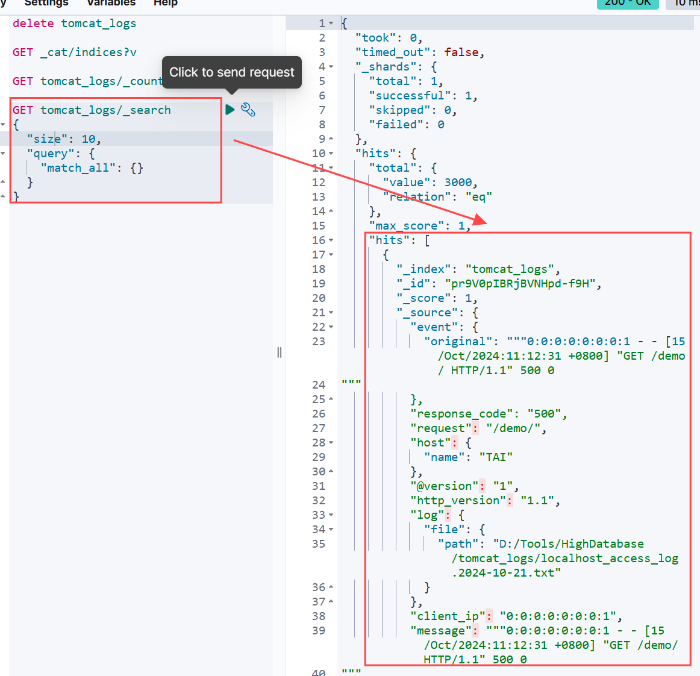

- 3.1.4 基于上传的tomcat日志文件练习有关日志的聚合操作

  1) 统计每种HTTP响应代码的出现次数。

     ```
     GET /tomcat_logs/_search
     {
       "size": 0,
       "aggs": {
         "response_codes": {
           "terms": {
             "field": "response_code.keyword",
             "size": 10
           }
         }
       }
     }
     ```

     运行结果：

     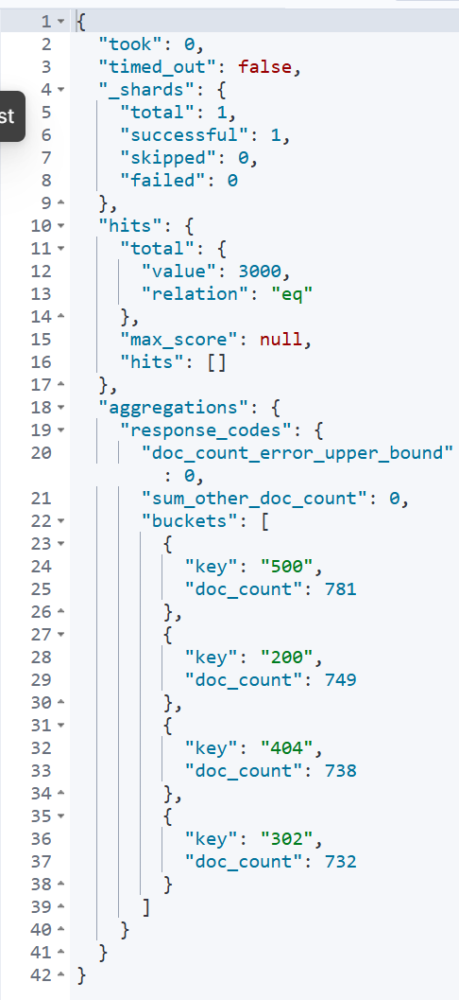

  2) 按小时对请求的数量进行汇总。

     ```
     GET /tomcat_logs/_search
     {
       "size": 0,  // 不返回文档，只返回聚合结果
       "aggs": {
         "requests_over_time": {
           "date_histogram": {
             "field": "@timestamp",  // 根据时间戳字段汇总
             "calendar_interval": "hour",  // 按小时进行汇总
             "format": "yyyy-MM-dd HH:mm:ss",  // 格式化时间
             "min_doc_count": 1  // 只返回至少有 1 个请求的时间段
           }
         }
       }
     }
     ```

     运行结果：

     

  3) 返回每个请求路径的访问次数。

     ```
     GET /tomcat_logs/_search
     {
       "size": 0,  // 不返回文档，只返回聚合结果
       "aggs": {
         "request_paths": {
           "terms": {
             "field": "request.keyword",  // 使用 keyword 类型聚合
             "size": 50  // 最多返回 50 个请求路径
           }
         }
       }
     }
     ```

     运行结果：

     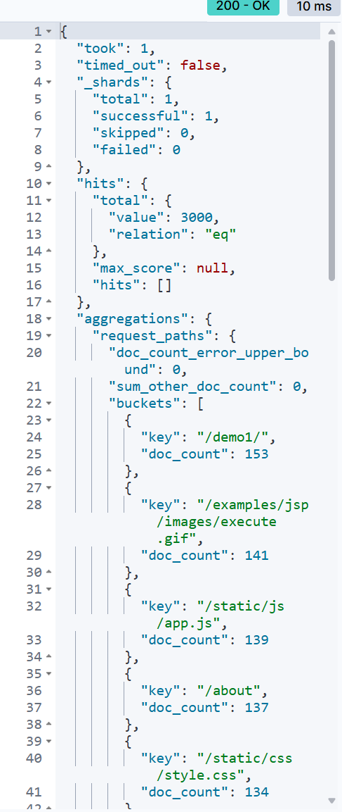

  4) 计算所有请求返回的总字节数。

     ```
     GET /tomcat_logs/_search
     {
       "size": 0,  // 不返回文档，只返回聚合结果
       "aggs": {
         "total_response_bytes": {
           "sum": {
             "field": "response_bytes"  // 针对返回字节数的字段
           }
         }
       }
     }
     ```

     运行结果：

     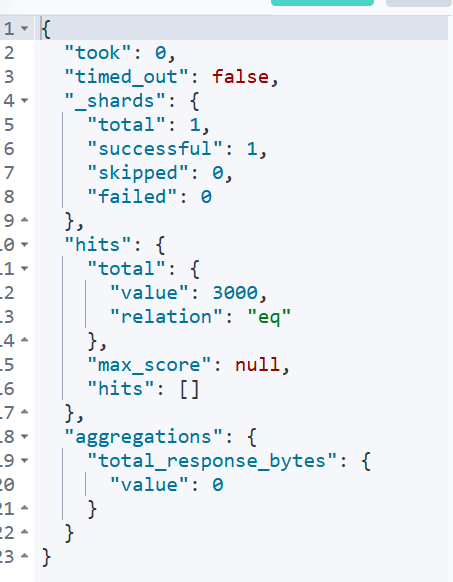

  5) 按 HTTP 响应代码和请求路径计算数量。

     ```
     GET /tomcat_logs/_search
     {
       "size": 0,  // 不返回文档，只返回聚合结果
       "aggs": {
         "response_code": {
           "terms": {
             "field": "response_code.keyword",  // 按响应代码分组
             "size": 10  // 最多返回 10 个响应代码
           },
           "aggs": {
             "paths": {
               "terms": {
                 "field": "request.keyword",  // 在每个响应代码内按请求路径分组
                 "size": 50  // 最多返回 50 个请求路径
               }
             }
           }
         }
       }
     }
     ```

     运行结果：

     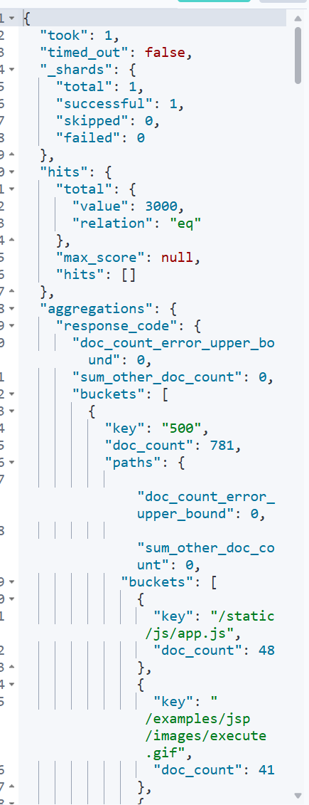

#### **3.2 数据转换和传输**

- 3.2.1 `logstash`配置文件

  写一个`mysql_to_es.conf`的配置文件，连接mysql和es

  ```
  input {
    jdbc {
      jdbc_driver_library => "D:/Tools/HighDatabase/logstash-8.12.2/jars/mysql-connector-j-9.1.0.jar"
      jdbc_driver_class => "com.mysql.cj.jdbc.Driver"
      jdbc_connection_string => "jdbc:mysql://localhost:3306/school_message"
      jdbc_user => "root"
      jdbc_password => "123456"
  
      # 设置查询的时间间隔，确保不会重复插入数据
      schedule => "* * * * *"  # 每分钟执行一次
      statement => "SELECT student_id, name, gender, birth_date, my_class, updated_at FROM student"
  
      # 防止重复插入，使用以下配置
      use_column_value => true   # 使用列值来跟踪更新
      tracking_column => "updated_at"  # 使用updated_at列进行跟踪
      clean_run => false
    }
  }
  
  output {
    elasticsearch {
      hosts => ["http://localhost:9200"]
      index => "students"
      document_id => "%{student_id}"
    }
    
    stdout {
      codec => rubydebug
    }
  }
  ```

- 3.2.2 在`lostash`目录下执行`bin\logstash.bat -f "D:\Tools\HighDatabase\logstash-8.12.2\config\mysql_to_es.conf"`

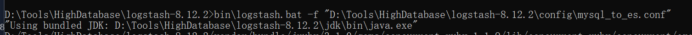

- 3.2.3 ES上检查是否和mysql连接成功

  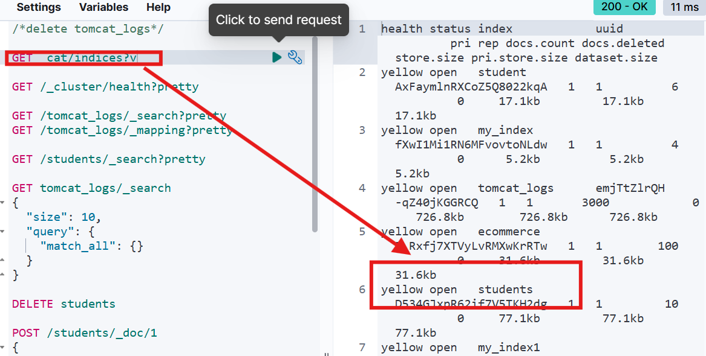

  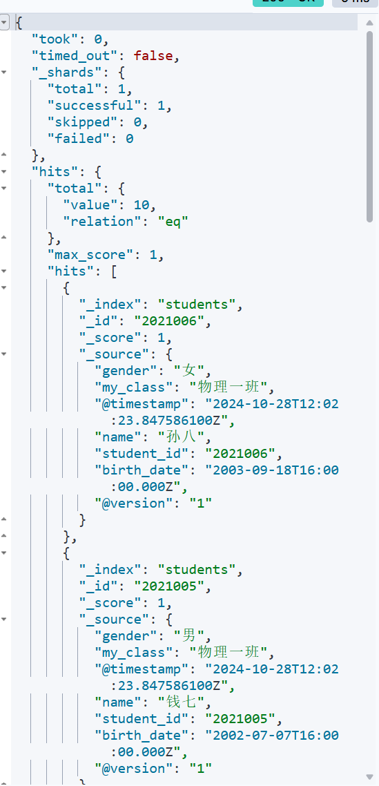

- 3.2.4 修改mysql数据库表，验证ES是否同步更新

  原本`student`表数据如下：

  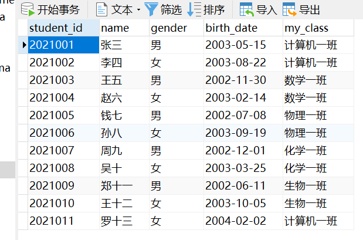

1）插入数据

```mysql
INSERT INTO student (student_id, name, gender, birth_date, my_class) 
VALUES ('2021012', '李小龙', '男', '2003-12-01', '艺术班');
```

2）更新数据

```mysql
UPDATE student 
SET my_class = '软件工程一班' 
WHERE student_id = '2021001';
```

修改后`student`表如下：

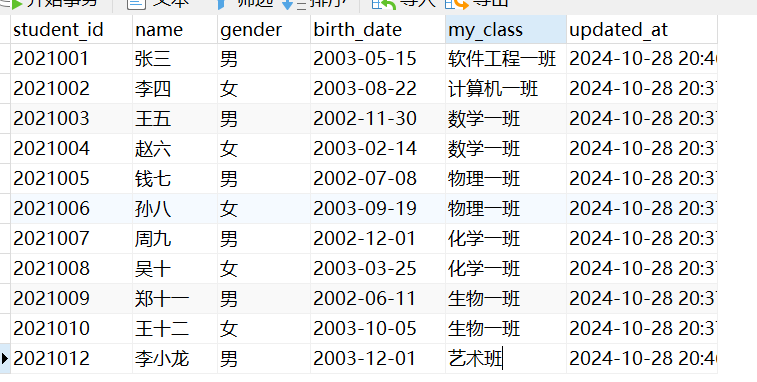

3）ES上同步更新的结果：

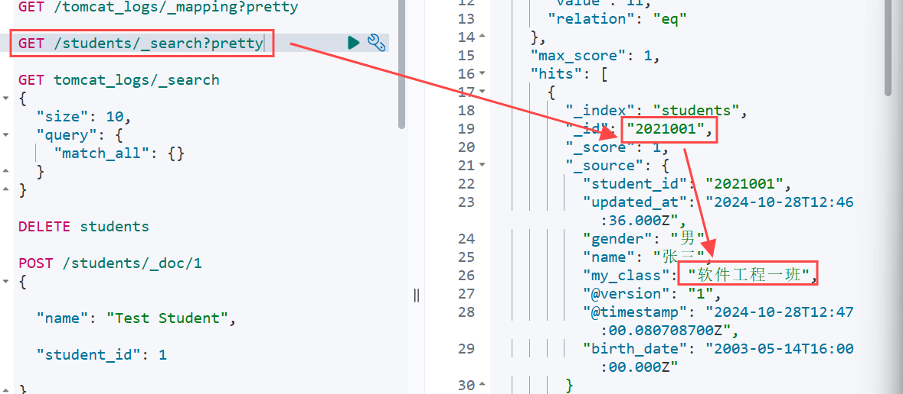

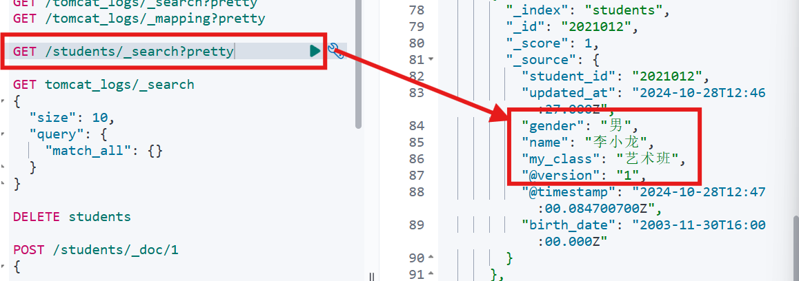
